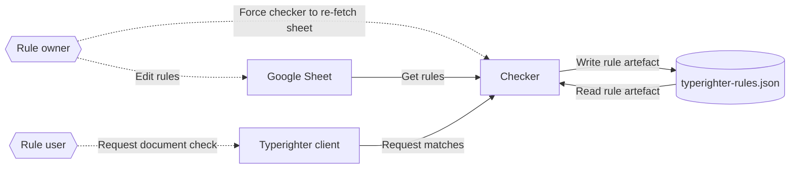

# Typerighter

Typerighter is the server-side part of a service to check a document against a set of user-defined rules. It's designed to work like a spelling or grammar checker. It contains two services, the [checker](https://checker.typerighter.gutools.co.uk/) and the [rule manager](https://manager.typerighter.gutools.co.uk/) – see [architecture](#architecture) for more information.

We use it at the Guardian to check content against our style guide. Max Walker, the subeditor who inspired the creation of Typerighter, has written an introduction [here](https://www.theguardian.com/help/insideguardian/2020/nov/20/introducing-typerighter-making-life-easier-for-journalists-and-stories-better-for-readers).

To understand our goals for the tool, see the [vision document](./vision.md).

For setup, see [the docs directory](./docs/).

For an example of a Typerighter client (the part that presents the spellcheck-style interface to the user), see [prosemirror-typerighter](https://github.com/guardian/prosemirror-typerighter).

## How it works: an overview

The Typerighter checker service ingests user-defined rules from a `RuleResource`. This is a Google sheet, but the interface could be fulfilled from an arbitrary source.

Each rule in the service corresponds to a `Matcher` that receives the document and passes back a list of `RuleMatch`. We have the following `Matcher` implementations:

- `RegexMatcher` uses regular expressions
- `LanguageToolMatcher` is powered by the [LanguageTool](https://languagetool.org/) project, and uses a combination of native LanguageTool rules and user-defined XML rules as its corpus

Matches contain the range that match applies to, a description of why the match has occurred, and any relevant suggestions – see the `RuleMatch` interface for the full description.

## Architecture

### Roles

- Rule owner: a person responsible for maintaining the rules that Typerighter consumes.
- Rule user: a person checking their copy with the checker service.

## Implementation

Both the checker and management services are built in Scala with the Play framework. Data is currently stored in a Google Sheet.

Google credentials are fetched from SSM using AWS Credentials or Instance Role. 

## Integration

The [prosemirror-typerighter](https://github.com/guardian/prosemirror-typerighter) plugin provides an integration for the [Prosemirror](https://prosemirror.net) rich text editor.

If you'd like to provide your own integration, this service will function as a standalone REST platform, but you'll need to use [pan-domain-authentication](https://github.com/guardian/pan-domain-authentication) to provide a valid auth cookie with your requests.

## Upgrading LanguageTool

LanguageTool has default rules that we use, and as we upgrade LT, these could change underneath us.

There's a script to see if rules have changed as a result of an upgrade in ./script/js/compare-rule-xml.js.

## Linting

Typerighter uses [Scalafmt](https://scalameta.org/scalafmt/) to ensure consistent linting across all Scala files.

To lint all files you can run `sbt scalafmtAll`
To confirm all files are linted correctly, you can run `sbt scalafmtCheckAll`

You can configure your IDE to format scala files on save according to the linting rules defined in [.scalafmt.conf](.scalafmt.conf)

For intellij there is a guide to set up automated linting on save [here](https://www.jetbrains.com/help/idea/work-with-scala-formatter.html#scalafmt_config) and [here](https://scalameta.org/scalafmt/docs/installation.html). For visual studio code with metals see [here](https://scalameta.org/scalafmt/docs/installation.html#vs-code)

## Automatic Linting

The project contains a pre-commit hook which will automatically run the linter on all staged files. To enable this, run `./script/setup-hooks` from the root of the project.
